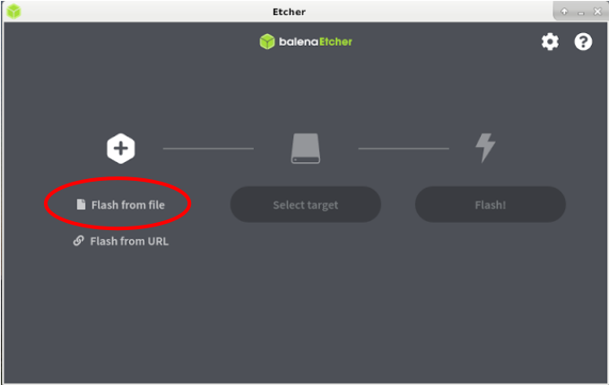
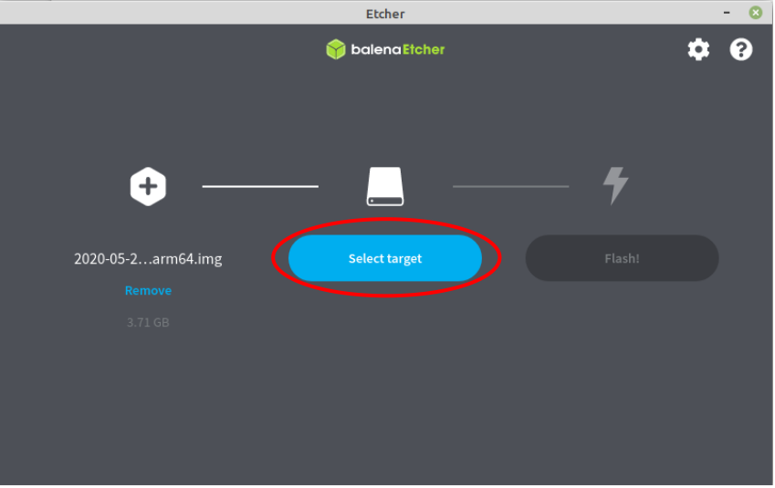
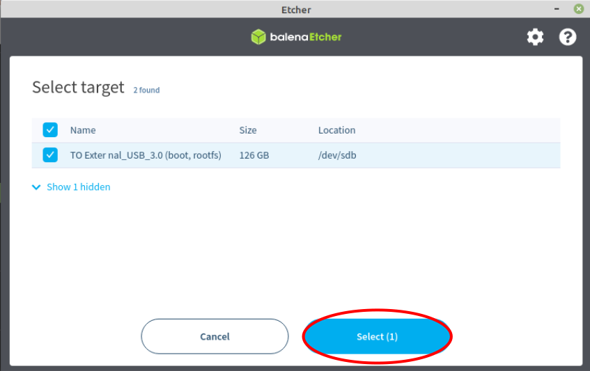
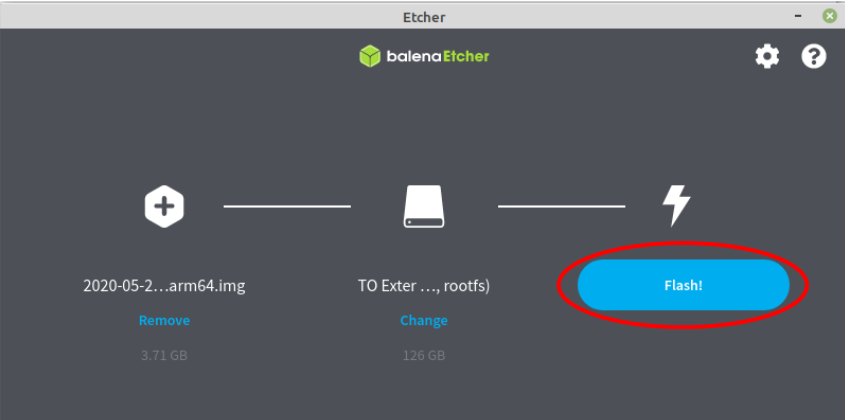

## 1 Hardware- und Softwarevoraussetzungen
Hardwarevoraussetzungen:

-  Rasperry Pi 4 mit mindestens 4 GB RAM 
-  ein passendes Gehäuse mit Lüfter für den Raspberry Pi
-  Offizielles Raspberry Pi Netzteil
-  Eine 2,5 Zoll USB-Festplatte (ab 250 GB oder mehr) - - > Wichtig: achtet darauf, das die USB-SSD   
   Festplatte eine externe Spannungsversorgung, also ein Netzteil mitgeliefert wird. 
-  USB - Kartenlesegerät für microSD Karten
-  Monitor mit HDMI Anschluss
-  Einen Micro-HDMI auf HDMI Adapter
-  Eine externe USB-Tastatur + kabelgebundene USB - Maus
-  Netzwerk bzw. Ethernet-LAN-Kabel mit einem RJ 45 Stecker (CAT-6)
-  Optional: Sunfounder 7 Zoll Touchscreen Display 
-  Optional: 1 microSD Karte mit 64 GB oder mehr. (Falls Ihr keine SSD verwenden wollt, würde ich aus
    Performancegründen für einen dauerhaften Nodebetrieb jedoch nicht empfehlen. Für Testzwecke ist das jedoch völlig ausreichend)

Softwarevoraussetzungen:

-  Raspberry Pi OS (64 bit)-beta
-  BalenaEtcher – Flash Tool um Rasperry Pi OS (64-bit) auf die USB-SSD-Festplatte zu flashen

Entpackt die heruntergeladene zip-Datei (2020-05-27-raspios-buster-arm64) am besten gleich in Eurem Download Verzeichnis. 

Damit hätten wir das Handwerkszeug zusammen und wir können uns nun der weiteren Einrichtung zuwenden. 


## 2 Download und Einrichtung von Raspberry Pi OS (64 bit)-beta

Ladet Euch nun das bekannte Flash Tool BalenaEtcher herunter:

- [ Download BalenaEtcher Flashtool](https://www.balena.io/etcher/)

Unter Windows: Navigiert zu Eurem Download Ordner und startet die Installation des Programms unter Windows mit einem Doppelklick. 

Unter Linux: Navigiert zu Eurem Download Ordner und führt einen Rechtsklick auf das heruntergeladene BalenaEtcher Flash-Tool aus. Öffnet die Eigenschaften und klickt auf den Reiter „Zugriffsrechte“ und setzt dort den Haken bei „der Datei erlauben, sie als Programm auszuführen“. Danach könnt Ihr die Datei mit einem Doppelklick ausführen. 

1. Klickt auf "Flash from file" und wählt das heruntergeladene und entpackte "2020-05-27-raspios-buster-arm64.img", aus Eurem Download Ordner auf Eurem Rechner aus. 



2. Wählt nun unter "Select target" das Zielmedium, also die angeschlossene USB-SSD-Festplatte aus. 



Die angeschlossene USB-SSD-Festplatte wird in der Regel automatisch von BalenaEtcher erkannt.



Hinweis: Falls Ihr die Meldung "... your SSD drive is unusally large for an SD card or USB stick" könnt Ihr diese vernachlässigen. Klickt auf Continue und danach auf Flash! 

3. "Flash" startet den Einrichtungsvorgang, nach Abschluss des Flashvorgangs findet noch ein Validierungsvorgang statt und anschließend habt Ihr ein startfähiges USB-SSD-Medium mit dem Betriebssystem Raspberry Pi OS (64 bit) - beta erstellt.



## 3 Kurzversion zur Einrichtung von Raspihive

Nachfolgend beschreibe ich stichpunktartig die erforderlichen Schritte zur Einrichtung von Raspihive. 
Nach dem Ihr das Raspbian OS (64 bit) beta Betriebssystem auf Eure USB-SSD Festplatte geflasht habt, könnt Ihr Euren Raspberry Pi mit Eurer Peripherie verkabeln und starten. Die weiteren Schritte sind: 
1. Grundlegende Konfiguration des Raspberry Pi‘s mit dem Einrichtungsassistent.
2. Fritz!Box (Router) Portfreigaben für die folgenden Ports erstellen : 80, 443, 15600 alle TCP und Port: 14626 UDP.
3. Klonen des Raspihive-Repositorys:
sudo git clone https://github.com/Raspihive/raspihive.git
4. Im Verzeichnis „pi“ die Textdatei „Raspihive“ auf den Desktop kopieren und mit ```sudo chmod +x Raspihive``` ausführbar machen.
5. Beim ersten Start von Raspihive:  Führt einen Doppelklick auf die erstellte Startdatei aus und wählt „im Terminal ausführen“ aus. Anschließend könnt Ihr im „Install Menu“ Hornet installieren.
Wenn Ihr eine eigene Domain besitzt, und DynDNS in der Fritzbox eingetragen oder bspw. den No-IP-Client installiert habt, könnt Ihr nach der Installation des Reverse Proxy‘s + Certbot Eure Domain aus dem Internet unter „Eure-Domain.xx“ aufrufen. Während der Installation im Terminal werdet Ihr dazu aufgefordert, ein Passwort zu vergeben. Dies ist das Passwort für den gesicherten Dashboard Zugriff. 
Der Benutzername lautet standardmäßig „Raspihive“ (ohne die „“).
6. Nach der Installation könnt Ihr dann im Terminal den Certbot Wizard mit dem Befehl 
sudo certbot –nginx
starten und für Eure Domain ein SSL-Zertifikat erhalten. 


## 4 Langversion zur Einrichtung von Raspihive

Nachfolgend beschreibe ich alle Schritte zur Einrichtung von Raspihive inklusive einiger Zusatzerklärungen. 

### 4.1 Grundlegende Konfiguration des Raspberry Pi‘s mit dem Einrichtungsassistent

Nach dem Flash-Vorgang Eurer USB-SSD-Festplatte mit BalenaEtcher könnt Ihr diese nun mit dem USB Port Eures Raspberry Pi‘s verbinden. Schließt darüber hinaus die USB-Maus und Tastatur an, verbindet das microHDMI Kabel mit einem der beiden microHDMI Ports des Raspberry‘s und das andere Ende des Monitorkabels in den HDMI Port Eures Hauptmonitors. Hierbei wird in der Regel ein HDMI auf microHDMI Adapter benötigt.  Optional jedoch empfehlenswert: Verbindet Euren Raspberry Pi vom Router- oder vom Switch ausgehend, per Netzwerkkabel mit der RJ 45 Buchse des Pi‘s. Schließt als letztes die Spannungsversorgung an den Pi mit dem originalen Rasberry Pi Netzteil an die USB-C-Schnittstelle an. 
Der erste Bootvorgang kann durchaus 5 – 10 Minuten dauern. 
In der Testphase hat sich herausgestellt, dass der USB-Bootvorgang bei manchen USB-SSD Festplatten, welche am USB 3.0 Port  (blaue Ports) am Raspberry Pi 4 angeschlossen sind, manchmal nicht ordnungsgemäß funktioniert. Falls dies bei Euch der Fall sein sollte, müsst Ihr für den erstmaligen Bootvorgang den USB 2.0 Port verwenden. In der Raspihive-App habe ich einen Fix dafür eingebaut, sodass nach Durchführung des SSD-Fixes Eure Festplatte danach auch von dem USB 3.0 Port starten sollte. 

Stellt an Eurem Hauptmonitor den richtigen HDMI-Port ein und Ihr werdet nach ungefähr 5 Minuten mit dem Anmeldebildschirm bzw. dem Ersteinrichtungsassistent begrüßt. 

Notiert Euch bitte die lokale IP-Adresse des Raspberry Pi‘s und klickt auf „Next“…


und nehmt die entsprechenden Länder-, Sprach- und Zeitzonen Einstellungen vor und klickt wiederum auf „Next“...


Vergebt nun ein sicheres Passwort für den standardmäßig gesetzten Benutzer Pi und klickt auf „Next“...


Wenn Ihr einen schwarzen Rand zwischen der aktuellen Anzeige und Eurem Monitor seht, dann setzt den Haken bei „This screen shows a black border around the desktop“ und klickt auf „Next“...


Bei diesem Schritt könnt Ihr auswählen ob Ihr Euren Raspberry Pi per WLAN mit Eurem Netzwerk verbinden möchtet. Dieser Schritt entfällt, wenn Ihr ein Netzwerkkabel in die RJ 45 Buchse des Pi‘s eingesteckt habt. Falls das bei Euch der Fall sein sollte, könnt Ihr einfach auf „Skip“ klicken...falls nicht, wählt Euren Accesspoint aus und klickt auf „Next“, anschließend müsst Ihr Euer WLAN-Zugangspasswort eingeben und der Raspberry Pi ist per WLAN mit Eurem Netzwerk verbunden. 


Der nächste Schritt ist sehr wichtig. Achtet generell stets darauf, das Ihr Euer Betriebssystem aktuell haltet und regelmäßig mit Updates versorgt. Dies verbessert generell die Stabilität, Leistungsfähigkeit und Sicherheit Eures Systems. Klickt auf „Next“ um den Aktualisierungsvorgang zu starten... 


welcher durchaus ein wenig Zeit beansprucht, da die verfügbaren Updates zunächst heruntergeladen...


und anschließend installiert werden...


Nach der erfolgreichen Aktualisierung des Systems, solltet Ihr Euren Raspberry Pi einmal neu starten, damit die Änderungen auch wirksam werden. 


Klickt dazu einmal auf „Restart“ und wartet bis Ihr wieder den Desktop seht. Der Neustart kann wieder ein paar Minuten dauern, also habt etwas Geduld an dieser Stelle ;) Der nächste Neustart geht danach sehr schnell vonstatten. 


### 4.2 Einrichtung der Portfreigaben in der Fritz!Box (Router) 

Bevor wir uns um die Einrichtung von Raspihive kümmern, müssen wir aktuell noch die folgenden Ports in unserem Router freigeben. 

Essentiell, Port: 14626, Protokoll UDP – Autopeering 
Essentiell, Port: 15600, Protokoll TCP – Gossip (neighbors) 
Optional, Port: 80 Protokoll TCP – Certbot
Optional, Port: 443 Protokoll TCP – Certbot

Da ich eine Fritz!Box verwende, zeige ich Euch die Einrichtung der Portfreigaben anhand der Fritzbox. 
1. Öffnet die Benutzeroberfläche der Fritz!Box indem Ihr in Euren Browser „fritz.box“ oder die lokale IP-Adresse: „192.168.178.1“ eintippt.
Das Login Passwort findet Ihr in der Regel auf dem Aufdruck, welcher an der Unterseite der Fritz!Box aufgebracht ist. Entnehmt das „Fritz!Box-Kennwort“ und gebt es auf dem Anmeldebildschirm bzw. auf der Login Seite der Fritz!Box Benutzeroberfläche ein und klickt auf „Anmelden“...


Klickt danach auf: „Internet“ (1)...


--> „Freigaben“ (2)  - - > „Gerät für Freigaben hinzufügen“ (3)...


Wählt nun unter dem Punkt „Gerät“ Euren Raspberry Pi aus. 


Die am Anfang notierte lokale IP Adresse, welche uns im Einrichtungsassistent angezeigt wurde, muss mit dieser IP, bei Punkt 2 (roter Pfeil) übereinstimmen. Es kann ja durchaus sein, das Ihr mehr als einen Raspberry Pi verwendet und dann könnt Ihr diese anhand der unterschiedlichen lokalen IP Adresse unterscheiden. Klickt anschließend auf „Neue Freigabe“ (3)...


Wählt hier unter „Anwendung“ - - > „Andere Anwendung“ (1) aus...


Tragt nun die entsprechende Bezeichnung (2) das entsprechende Protokoll (UDP oder TCP) (3) sowie die freizugebende Portnummer (4) ein.


Für den Betrieb einer Hornet Node ohne ein SSL Zertifikat, reicht es aus, wenn Ihr die ersten beiden „essentiellen“ Ports freigebt. Wenn Ihr jedoch eine eigene Domain habt, welche Ihr unter dem Punkt DnyDNS in der Fritz!Box eingetragen habt, dann könnt Ihr auch die optionalen Ports 80 – HTTP und 443 – HTTPS freigeben. Klickt nach dem Setzen der Portfreigaben auf „OK“, damit Eure eingestellten Portfreigaben übernommen werden...


und dann noch einmal auf „Übernehmen“. Damit sind die Portfreigaben gesetzt und aktiviert. Ihr erkennt dies auch an den Punkten, die von grau auf grün umspringen.


Jetzt sind die Vorbereitungen soweit abgeschlossen und wir können uns der Einrichtung von Raspihive widmen.

### 4.3 Klonen des Raspihive Repositorys von Github

Der größte Teil ist nun vollbracht. Nun beginnt der spannende Teil des Tutorials.
Öffnet auf dem Desktop des Raspberry Pi‘s den in der oberen Taskleiste integrierten Chromium Webbrowser.


Tippt in die Adresszeile (1) des Browsers die folgende Github Adresse ein:
„https://github.com/Raspihive/raspihive“ - - > Klickt anschließend auf den grünen Code Button (2) und dann auf den Linkadresse kopieren Button (3)...


Öffnet, nachdem Ihr die Linkadresse in den Zwischenspeicher kopiert habt, auf Eurem Raspberry Pi das Terminal und kopiert den nachfolgenden Befehl in das Terminal...


Gebt zunächst „sudo git clone“ + den kopierten Link ein.
Um den Link einzufügen müsst Ihr einmal einen Rechtsklick im Terminal ausführen und dann „Einfügen“ auswählen:
Der vollständige Befehl sieht dann so aus:
„sudo git clone https://github.com/Raspihive/raspihive.git“


Damit wurde das Raspihive Github Repository in das Verzeichnis „pi“ heruntergeladen bzw. geklont.


### 4.4 Verknüpfung der mitgelieferten Raspihive-Startdatei erstellen und die Datei

Wir bleiben zunächst noch im Terminal um die mitgelieferte Raspihive-Startdatei ausführbar zu machen. Danach könnt Ihr Raspihive bequem mit einem Doppelklick starten… ;)
Gebt dazu nacheinander die folgenden Befehle ein:

•	cd raspihive
•	sudo mv Raspihive /home/pi/Desktop
•	cd .. (beachtet das Leerzeichen zwischen cd und ..)
•	cd Desktop
•	sudo chmod +x Raspihive

Ihr seht spätestens nach der Eingabe des zweiten Befehls die Raspihive Startdatei auf Eurem Desktop. Wenn Ihr alle Befehle eingegeben habt, könnt Ihr das Terminalfenster schließen.


### 4.5 Erster Start von Raspihive und Installation der Hornet Node

Führt einen Doppelklick auf die erstellte Raspihive-Startdatei auf Eurem Desktop aus.


und wählt einmalig „Im Terminal ausführen“ (2) aus, wenn Ihr ein SSL Zertifikat für Eure Node bzw. Domainnamen benötigt. Ihr könnt Raspihive nach der Ersteinrichtung des SSL Zertifikats anschließend mit „Ausführen“ Starten. Wir brauchen das Terminal aktuell nur einmalig für die Vergabe des Dashboard Passworts sowie für den Certbot Prozess.  Ansonsten reicht es, wenn Ihr beim Start von Raspihive einfach auf „Ausführen“ klickt, um Raspihive zu starten.  

Voilà! - Nun befindet Ihr Euch im Hauptmenü von Raspihive!
Um Hornet zu installieren müsst Ihr lediglich ins „Install menu“ navigieren...


Und auf „Install Hornet“ klicken ;)  


Der erfolgreiche Abschluss der Installation wird mit einem Infofenster „Hornet Node successfully installed“ quittiert.


Hornet startet automatisch und beginnt mit dem Download der Snapshot Datei, welche Ihr den Logs entnehmen könnt. Damit Ihr sehen könnt, was Eure Node gerade macht, werfen wir mal einen Blick in die Logs…;) Klickt im „Install Menu“ auf „Return to start page“...

...und dann auf „Node control“ und dann auf „Hornet Node Control“...


Klickt auf „Watch the logs“...und Ihr seht die letzten Einträge der Logfile...


Danach könnt Ihr das Fenster wieder schließen in dem Ihr einfach auf „Quit-Log window“ klickt...


Damit sind wir mit der grundlegenden Einrichtung der IOTA-Hornet Fullnode fertig. Kurz ein paar Worte zu den Prozessen die im Hintergrund ablaufen. Raspihive kümmert sich nicht nur um die Einrichtung der Hornet Node, sondern kümmert sich auch um die Sicherheit und installiert und konfiguriert die Firewall, setzt die richtigen Portfreigaben und installiert auch automatisch den SSH-Guard.

### 4.6 Optional: Installation des Reverse Proxy‘s + Certbot + Prozess zum Erhalt eines 			 SSL-Zertifikats von Let‘s Encrypt

Für diesen Schritt benötigt Ihr eine Domain, welche Ihr bspw. sehr günstig bei dem Anbieter Selfhost.de erhalten könnt. Wie das geht, habe ich hier beschrieben:
https://iota-industrie-4-0.blogspot.com/2019/07/erhalt-einer-statischen-domain-von.html
Wenn Ihr eine eigene Domain bspw. von Selfhost besitzt, und die DynDNS Daten in der Fritzbox eingetragen oder alternativ den No-IP-Client installiert habt, könnt Ihr nach der Installation des Reverse Proxy‘s + Certbot Eure Domain aus dem Internet unter „Eure-Domain.xx“ aufrufen.

Klickt dazu einmal im „Install menu“ auf „Install Nginx + Certbot“

<img src="../images/etcher4.png"

Während der Installation im Terminal werdet Ihr dazu aufgefordert, einmalig ein Passwort für den Dashboard Zugriff zu vergeben. Notiert Euch das Passwort oder speichert es alternativ gleich in einem Passwort Manager ab. Dies ist das Passwort, welches Ihr für den Zugriff auf das Dashboard benötigt. Der Benutzername lautet standardmäßig „Raspihive“ (ohne die „“). Wichtiger Hinweis: Die Eingabe des Passworts wird Euch während der Eingabe standardmäßig nicht angezeigt! Achtet auch darauf, das Ihr mit der Maus auch einmal kurz auf das Terminal klickt. Achtet auf den roten Kreis im Terminalfenster. So sollte das bei Euch aussehen.

<img src="../images/etcher4.png"

aus Sicherheitsgründen bzw. damit man Tippfehler weitestgehend ausschließen kann, muss man das Passwort ein zweites Mal eingeben.

<img src="../images/etcher4.png"

Der erfolgreiche Abschluss der Installation des Reverse Proxy‘s (Nginx) und des Certbots wird durch die Anzeige einer Infobox bestätigt.

<img src="../images/etcher4.png"

Öffnet nach der Installation ein neues Terminal Fenster und startet den Certbot Wizard mit dem Befehl:
sudo certbot --nginx
um für Eure Domain ein SSL-Zertifikat zu erhalten.

<img src="../images/etcher4.png"

Ihr müsst zunächst Eure E-Mail Adresse eingeben, damit Ihr eine Benachrichtigung erhaltet, wenn das Zertifikat ausläuft. In der Regel sind die Zertifikate 90 Tage lang gültig und müssen danach erneuert werden. Bestätigt die Eingabe mit der Enter-Taste...

<img src="../images/etcher4.png"

Danach muss man mit „A“ die Terms of Services akzeptieren...

<img src="../images/etcher4.png"

Bei der nächsten Angabe werdet Ihr gefragt, ob Ihr Eure E-Mail Adresse mit der Electronic Frontier Foundation teilen möchte. Ich habe hier „Y“ gewählt.

<img src="../images/etcher4.png"

Im nächsten wichtigen Schritt, müsst Ihr nun Eure Domain eintragen und die Eingabe mit Enter bestätigen...

<img src="../images/etcher4.png"

Als letztes wählt hier die 2 aus, damit alle Anfragen von HTTP automatisch an HTTPS weitergeleitet werden.

<img src="../images/etcher4.png"

Am Ende solltet Ihr die Meldung: „Congratulations“ sowie eine kleine Zusammenfassung über das installierte SSL-Zertifikat sehen. Mein Zertifikat würde, wie es im Screenshot zu sehen ist, bspw. am 23.02.2020 auslaufen. Nun könnt Ihr das Terminalfenster schließen und Eure Node über Eure abgesicherte Domain erreichen.

<img src="../images/etcher4.png"

Damit haben wir die Einrichtung der Hornet Node abgeschlossen.

Zeit, um an dieser Stelle mal einen Blick ins Dashboard zu werfen. Klickt im Hauptmenü von Raspihive auf „Dashboard access“...

<img src="../images/etcher4.png"

Klickt auf „Open dashboard“...

<img src="../images/etcher4.png"

Gebt als Username Raspihive sowie euer vergebenes Passwort ein, welches Ihr während der Installation von Nginx und Certbot im Terminal vergeben habt.

 https://t.me/einfachIOTA

Euer
PIOTA
