## 1 Hardware and software requirements
Hardware requirements:

- Rasperry Pi 4 with at least 4 GB RAM 
- a suitable case with fan for the Raspberry Pi
- Official Raspberry Pi power supply
- A 2.5 inch USB hard disk (250 GB or more) --> Important: make sure that the USB-SSD   
   hard disk an external power supply, i.e. a power supply unit is supplied. 
- USB - card reader for microSD cards
- Monitor with HDMI connector
- A Micro-HDMI to HDMI adapter
- One external USB keyboard + wired USB mouse
- Network or Ethernet LAN cable with an RJ 45 connector (CAT-6)
- Optional: Sunfounder 7 inch touchscreen display 
- Optional: 1 microSD card with 64 GB or more. (If you don't want to use a SSD, I would choose from
    However, we do not recommend continuous node operation for performance reasons. For test purposes this is completely sufficient)

Software requirements:

- Raspberry Pi OS (64 bit) beta
- BalenaEtcher - Flash tool to flash Rasperry Pi OS (64-bit) to USB-SSD hard disk

Unpack the downloaded zip-file (2020-05-27-raspios-buster-arm64) in your download directory. 

Now we have all required tools and we can start to set up the rest. 


## 2 Download and setup Raspberry Pi OS (64 bit) beta

Download now the well-known flash tool BalenaEtcher:

- [ Download BalenaEtcher flash tool ](https://www.balena.io/etcher/)

Under Windows: Navigate to your download folder and double-click to start the installation of the program under Windows. 

Under Linux: navigate to your download folder and right-click on the downloaded BalenaEtcher Flash tool. Open the properties and click on the tab "Access rights" and check the box "Allow the file to run as a program". After that you can execute the file by double clicking on it. 

1. click on "Flash from file" and select the downloaded and unzipped "2020-05-27-raspios-buster-arm64.img", from your download folder on your computer 

<p>
    
</p>

Now select the target medium under "Select target", i.e. the connected USB-SSD hard disk. 


The connected USB SSD hard drive is usually automatically recognized by BalenaEtcher.


Note: If you receive the message "... your SSD drive is unusually large for an SD card or USB stick" you can ignore it. Click on Continue and then on Flash! 

Flash" starts the setup process, after the flash process is finished a validation process takes place and then you have created a bootable USB-SSD medium with the operating system Raspberry Pi OS (64 bit) - beta.


## 3 Short version for setting up Raspihive

In the following, I will describe the steps necessary to set up Raspihive. 
After you have flashed the Raspbian OS (64 bit) beta operating system onto your USB-SSD hard drive, you can wire your Raspberry Pi to your peripherals and start it. The next steps are: 
1. basic configuration of your Raspberry Pi with the setup wizard.
2. create Fritz!Box (Router) port shares for the following ports : 80, 443, 15600 all TCP and port: 14626 UDP.
3. clone the Raspihive repository:
sudo git clone https://github.com/Raspihive/raspihive.git
4. copy the text file "Raspihive" in the directory "pi" to the desktop and make it executable with ```sudo chmod +x Raspihive``.
5. the first time Raspihive is started: double-click on the created start file and select "run in terminal". Then you can install Hornet in the "Install Menu".
If you have your own domain, and have entered DynDNS in the Fritzbox or installed the No-IP-Client, you can call your domain from the internet under "Your-Domain.xx" after installing the Reverse Proxy + Certbot. During the installation in the terminal you will be asked to enter a password. This is the password for secure dashboard access. 
The default username is "Raspihive" (without the "").
6. after the installation you can start the Certbot Wizard in the terminal with the command 
sudo certbot -nginx
and get a SSL certificate for your domain. 


## 4 Long version for setting up Raspihive

In the following I describe all steps to set up Raspihive including some additional explanations. 

### 4.1 Basic configuration of the Raspberry Pi's with the setup wizard

After flashing your USB SSD hard drive with BalenaEtcher, you can now connect it to the USB port of your Raspberry Pi. In addition, connect the USB mouse and keyboard, connect the microHDMI cable to one of the two microHDMI ports of your Raspberry and the other end of the monitor cable to the HDMI port of your main monitor. This usually requires an HDMI to microHDMI adapter.  Optional but recommended: Connect your Raspberry Pi from the router or switch to the RJ 45 socket of the Pi with a network cable. Finally connect the power supply to the pi with the original Rasberry Pi power supply to the USB-C interface. 
The first boot process can take 5 - 10 minutes. 
During the test phase it turned out that the USB boot process sometimes doesn't work properly with some USB-SSD hard drives connected to the USB 3.0 port (blue ports) on the Raspberry Pi 4. If this should be the case, you have to use the USB 2.0 port for the first boot process. In the Raspihive app I've included a fix for this, so after the SSD fix has been done your hard drive should boot from the USB 3.0 port afterwards. 

Set the correct HDMI port on your main monitor and you will be welcomed after about 5 minutes with the login screen or the initial setup wizard. 

Please make a note of the local IP address of the Raspberry Pi's and click on "Next"...

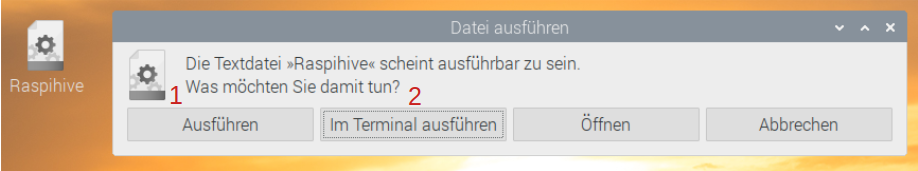

and make the appropriate country, language and time zone settings and click "Next" again...


Now set a secure password for the default user Pi and click on "Next"...


If you see a black border between the current screen and your monitor, check "This screen shows a black border around the desktop" and click "Next"...


At this step you can choose if you want to connect your Raspberry Pi to your network via WLAN. This step is not necessary if you have plugged a network cable into the RJ 45 socket of the Pi. If this is the case for you, you can simply click on "Skip"...if not, select your access point and click on "Next", then enter your WLAN access password and the Raspberry Pi is connected to your network via WLAN. 

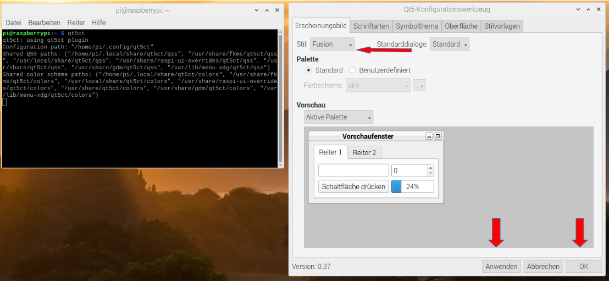

The next step is very important. Always make sure that you keep your operating system up to date and that you provide regular updates. This generally improves the stability, performance and security of your system. Click on "Next" to start the update process... 

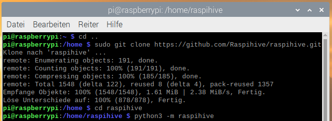

which may take a little time, because the available updates are downloaded first...


and installed afterwards...


After successfully updating your system, you should restart your Raspberry Pi to make the changes effective. 


Click once on "Restart" and wait until you see the desktop again. The restart may take a few minutes again, so be patient at this point ;) The next restart will be very fast. 


### 4.2 Setting up the port shares in the Fritz!Box (Router) 

Before we take care of setting up Raspihive, we currently need to enable the following ports in our router. 

Essential, Port: 14626, Protocol UDP - Autopeering 
Essential, Port: 15600, Protocol TCP - Gossip (neighbors) 
Optional, Port: 80 Protocol TCP - Certbot
Optional, Port: 443 Protocol TCP - Certbot

Since I'm using a Fritz! box, I'll show you how to set up the port shares using the Fritzbox. 
1. open the user interface of the Fritz!box by typing "fritz.box" in your browser or the local IP address: "192.168.178.1
The login password is usually printed on the bottom of the Fritz!Box. Take the "Fritz!Box password" and enter it on the login screen or on the login page of the Fritz!Box user interface and click on "Login"...


Then click on: "Internet" (1)...


--> "Shares" (2) - - > "Add device for shares" (3)...

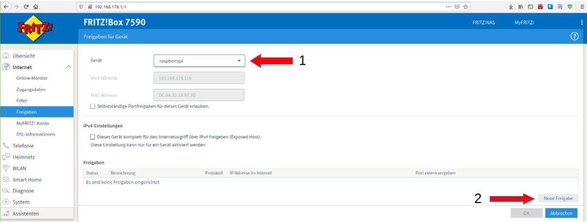

Now select your Raspberry Pi under the item "Device". 

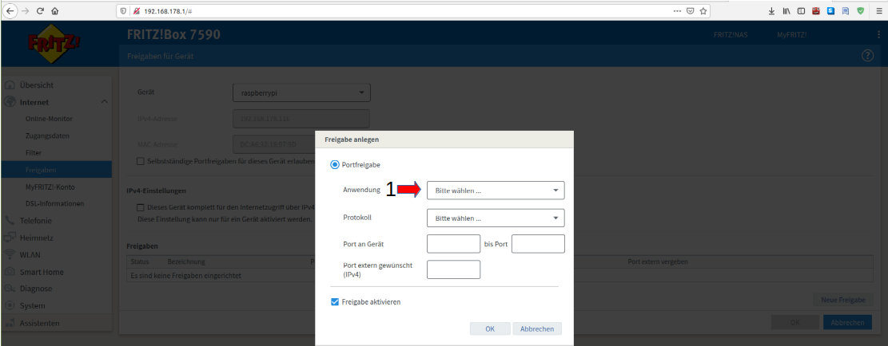

The local IP address noted at the beginning, which was displayed in the setup wizard, must match this IP at point 2 (red arrow). It is possible that you are using more than one Raspberry Pi and then you can distinguish them by the different local IP address. Then click on "New share" (3)...


Select here under "Application" - - > "Other application" (1)...


Now enter the corresponding designation (2), the corresponding protocol (UDP or TCP) (3) and the port number to be released (4).

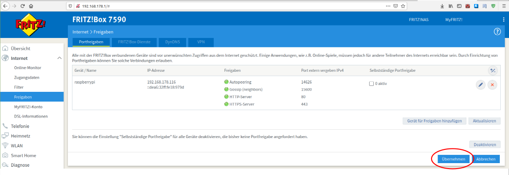

To operate a Hornet Node without a SSL certificate, it is sufficient to open the first two "essential" ports. However, if you have your own domain, which you have entered under DnyDNS in the Fritz! box, then you can also release the optional ports 80 - HTTP and 443 - HTTPS. After setting the port shares click on "OK", so that your set port shares are taken over...


and then click on "Apply" again. Now the port releases are set and activated. You can also see this by the dots that change from grey to green.

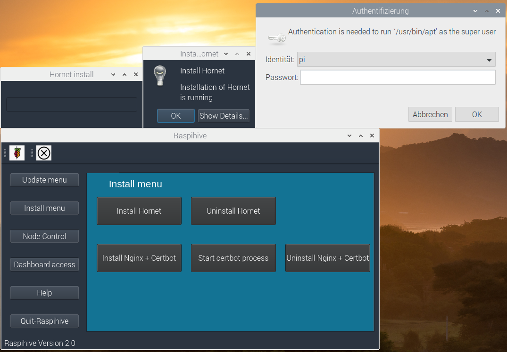

Now the preparations are finished and we can dedicate ourselves to the establishment of Raspihive.

### 4.3 Cloning the Raspihive repository of Github

Most of the work is now done. Now the exciting part of the tutorial begins.
Open the Chromium Webbrowser on the desktop of your Raspberry Pi.

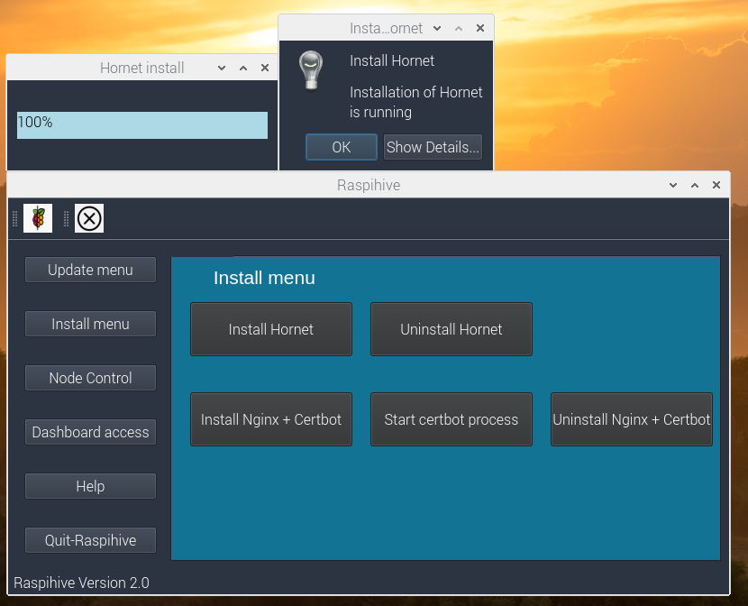

Type the following github address into the address line (1) of the browser:
"https://github.com/Raspihive/raspihive" - - > Click on the green code button (2) and then on the copy link address button (3)...


After you have copied the link address into the clipboard, open the terminal on your Raspberry Pi and copy the following command into the terminal...


First enter "sudo git clone" + the copied link.
To paste the link you have to right click once in the terminal and then select "Paste":
The complete command looks like this:
"sudo git clone https://github.com/Raspihive/raspihive.git"

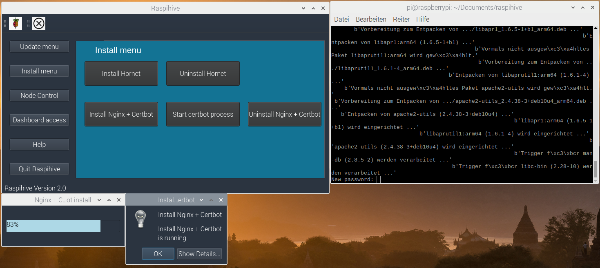

With this the Raspihive Github Repository was downloaded or cloned into the "pi" directory.


### 4.4 Create a shortcut to the supplied Raspihive start file and

We stay in the terminal for now to make the included Raspihive startup file executable. After that you can start Raspihive with a double click... ;)
Enter the following commands one after the other:

- cd raspive
- sudo mv Raspihive /home/pi/Desktop
- cd ... (note the space between cd and ..)
- cd desktop
- sudo chmod +x raspihive

You will see the Raspihive startup file on your desktop after entering the second command. When you have entered all commands, you can close the terminal window.

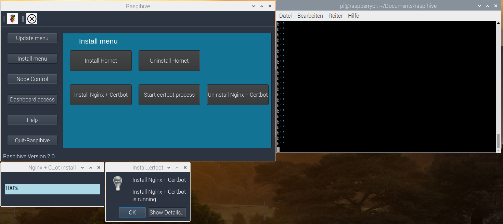

### 4.5 First start of Raspihive and installation of the Hornet Node

Double-click on the Raspihive startup file created on your desktop.


and select "Run in Terminal" (2) once if you need an SSL certificate for your node or domain name. After the initial setup of the SSL certificate you can start Raspihive with "Run". We currently need the terminal only once for the dashboard password and for the Certbot process.  Otherwise it's enough to simply click on "Run" when you start Raspihive to start Raspihive.  

Voilà! - Now you are in the main menu of Raspihive!
To install Hornet you only have to navigate to the "Install menu"...


And click on "Install Hornet" ;)  


The successful completion of the installation is confirmed with an info window "Hornet Node successfully installed".


Hornet starts automatically and starts downloading the snapshot file, which you can find in the logs. So you can see what your node is doing at the moment, let's have a look at the logs... ;) Click on "Return to start page" in the "Install Menu"...

...and then on "Node control" and then on "Hornet Node Control"...


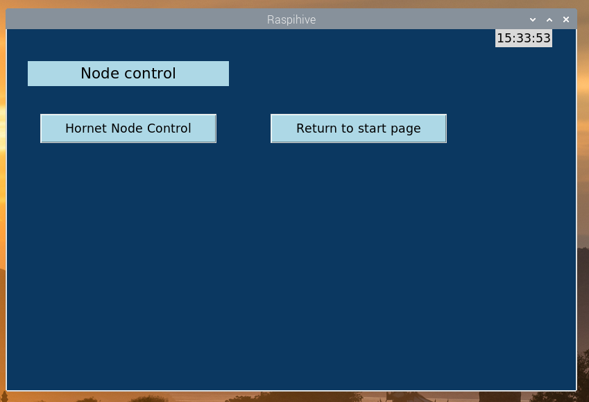

Click on "Watch the logs"...and you will see the last entries of the logfile...


Afterwards you can close the window by clicking on "Quit-Log window"...

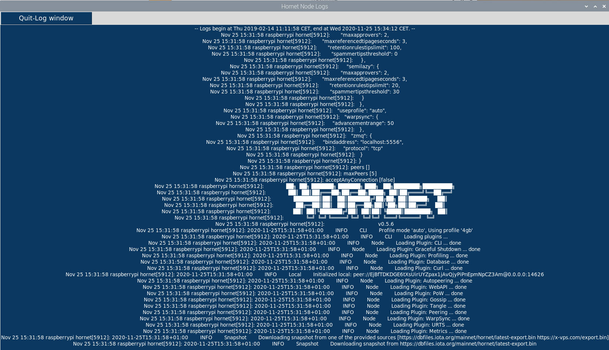

Now we are finished with the basic setup of the IOTA-Hornet Fullnode. A few words about the processes that run in the background. Raspihive not only takes care of the Hornet Node setup, but also takes care of security and installs and configures the firewall, sets the correct port shares and also automatically installs SSH-Guard.

### 4.6 Optional: Installation of the reverse proxy + Certbot + process for obtaining an SSL certificate from Let's Encrypt

For this step you need a domain, which you can get for example very cheap from the provider Selfhost.de. How this works, I have described here:
https://iota-industrie-4-0.blogspot.com/2019/07/erhalt-einer-statischen-domain-von.html
If you have your own domain, e.g. from Selfhost, and you have entered the DynDNS data in the Fritzbox or alternatively installed the No-IP-Client, you can access your domain from the internet under "Your-Domain.xx" after installing the Reverse Proxy's + Certbot.

Just click once in the "Install menu" on "Install Nginx + Certbot

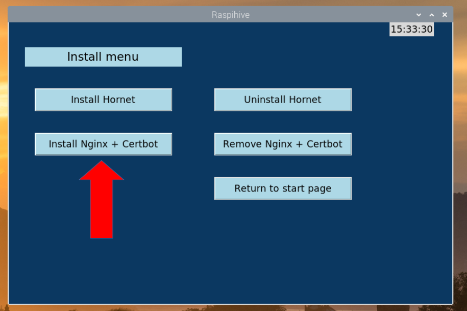

During the installation in the terminal you will be asked to enter a password for the dashboard access. Make a note of the password or save it in a password manager. This is the password you need to access the dashboard. The default username is "Raspihive" (without the ""). Important note: By default, the password is not displayed during the input! Also make sure that you click with the mouse on the terminal once. Pay attention to the red circle in the terminal window. This is how it should look like on your computer.

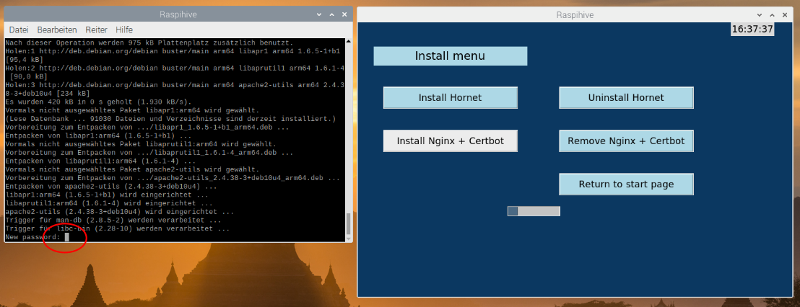

for security reasons or to avoid typing errors, you have to enter the password a second time.


The successful completion of the installation of the reverse proxy (Nginx) and the certbot is confirmed by the display of an info box.

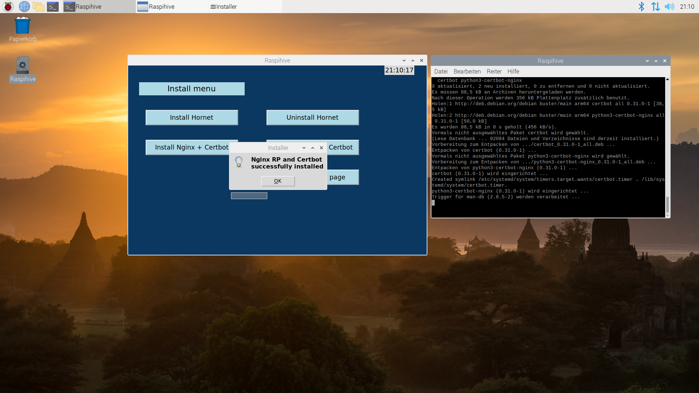

Opens a new terminal window after installation and starts the Certbot Wizard with the command
sudo certbot --nginx
to get an SSL certificate for your domain.

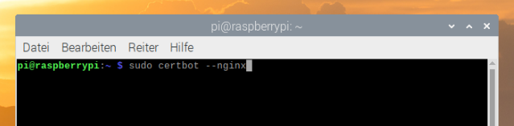

You must first enter your email address to receive notification when the certificate expires. Usually certificates are valid for 90 days and must be renewed after that. Confirm the entry with the Enter key...

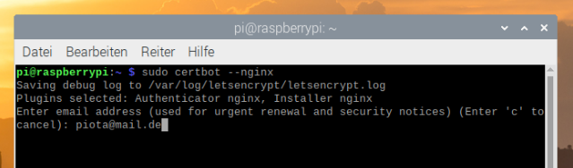

After that you have to accept the Terms of Services with "A"...


The next time you enter your email address, you will be asked if you want to share your email address with the Electronic Frontier Foundation. I have chosen "Y" here.


In the next important step, you have to enter your domain and confirm the input with Enter...

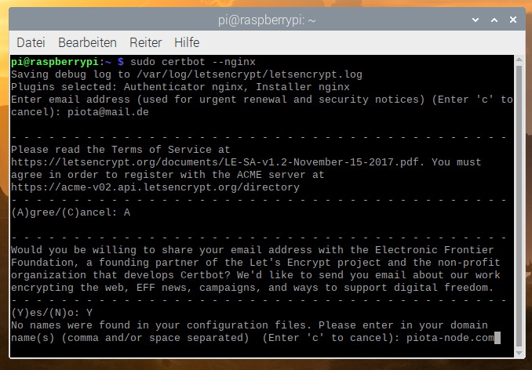

Finally, select 2 here so that all requests from HTTP are automatically forwarded to HTTPS.


At the end you should see the message: "Congratulations" and a short summary about the installed SSL certificate. My certificate would expire, as shown in the screenshot, for example on 23.02.2020. Now you can close the terminal window and reach your node via your secured domain.

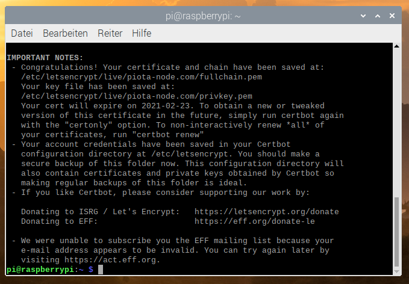

With this we have completed the setup of the Hornet Node.

Time to take a look at the dashboard at this point. Click on "Dashboard access" in the main menu of Raspihive...

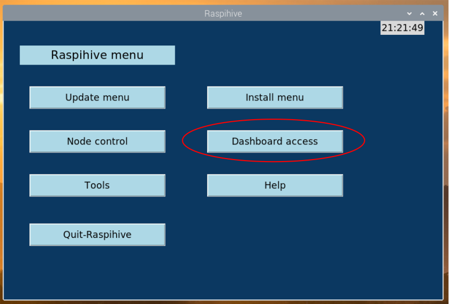

Click on "Open dashboard"...

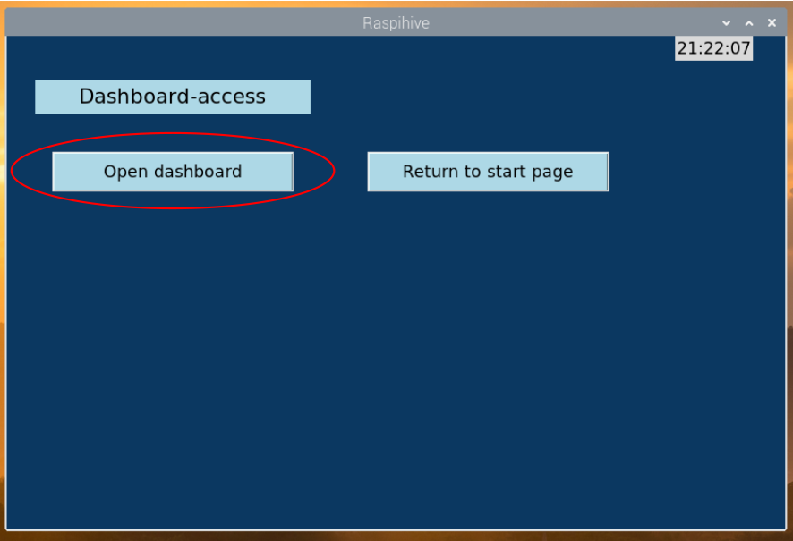

Enter as username Raspihive and your assigned password, which you used during the installation of Nginx and Certbot in the terminal.


And now you are in the Hornet-Dashboard ;)


This brings us to the end of setting up a Hornet Node with Raspihive. In the following points I will briefly describe the further functions and give some tips for the smooth operation of the Hornet Node as well as an outlook on the further exciting development of Raspihive.

## 5. further functions of Raspihive

5. other functions of Raspihive

- Since regular system updates are very important, you should provide your operating system with updates in addition to the Hornet updates. Just click on "System-update" and wait until the update is finished. Raspihive also takes care of the system maintenance and removes unnecessary packages automatically.

- The point "Packages-update" refers to the necessary additional programs, such as the Build-essentials, Snapd and Go, which are automatically installed during the Hornet installation. If you only want to update these packages, you can do so by clicking on the Packages-update button.

- Raspihive-update: From time to time more exciting features or bugfixes of Raspihive will appear. So that you can benefit from them, I have integrated a Raspihive-update function. You can also follow the project status on Github at https://github.com/raspihive.

- Hornet-update: When a Hornet-update is released by the developers...just click the button ;)


The Hornet Node Control Center:
Here you have the possibility to start, stop or restart your Hornet Node or just have a look at the logs from time to time.
If the Hornet Node or the database crashes, you can restart it with a simple click on "Remove the mainnetdb". If the question comes up: You don't have to stop the node first, then delete the database and start the node again manually or by mouse click, these functions are already stored, so a simple mouse click is sufficient...


To the tools:
- Ping - With the ping tool you can check the availability of a host.
- Mount DB - With this tool you can move the Hornet Node to an external hard disk. However, this feature is still in the beta phase.
- SSD-fix - with a click on this button the USB boot problem with some USB-SSD hard drives is solved, so that they will boot from the USB 3.0 port afterwards. This feature was tested by me and works. But I can't say if it works with all hard drives on the market and therefore this tool got the beta status from me.  

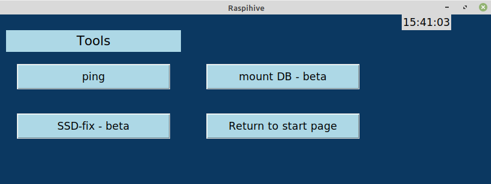

## 6 outlook and further development of Raspihive

Since Raspihive wants to make the setup and operation of an IOTA fullnode as easy as possible, further development work will be aimed at automating everything as much as possible. In addition to Hornet, the installation of the Bee-Node per mouse click will be integrated into Raspihive next year. Besides the integration of many planned additional features, the focus will also be on security, reliability and design.

If you have fun developing and programming or are interested and want to learn something, we would be very happy if you want to participate in this exciting project. Besides your feedback, you are welcome to integrate your own ideas into Raspihive.

Many thanks to Olsche from www.easy-passphrase-saver.de as a tester for his valuable feedback, which helped us to constantly improve Raspihive.

As always, I am always available for any questions you may have.
You are also welcome to visit the einfachIOTA Telegram Group - - > https://t.me/einfachIOTA

Yours
PIOTA
