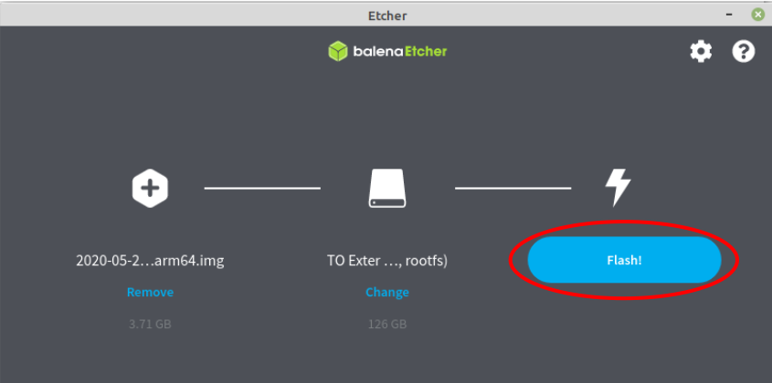
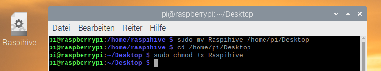
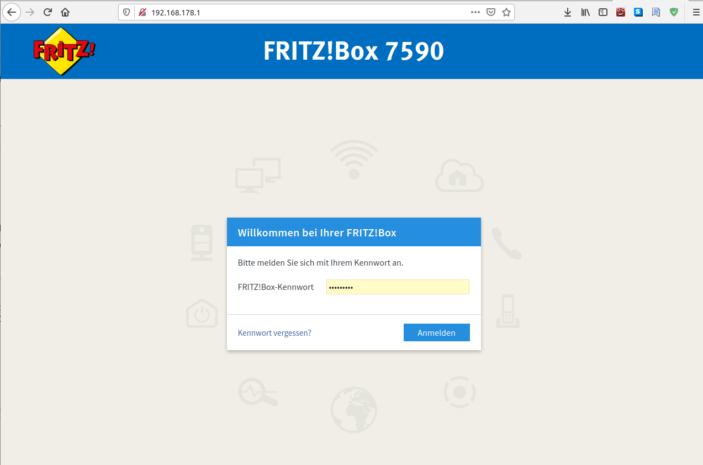
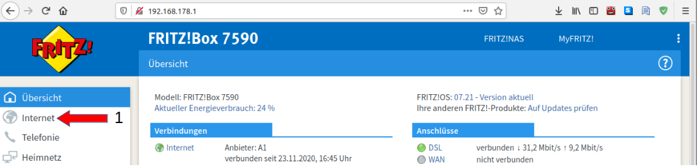
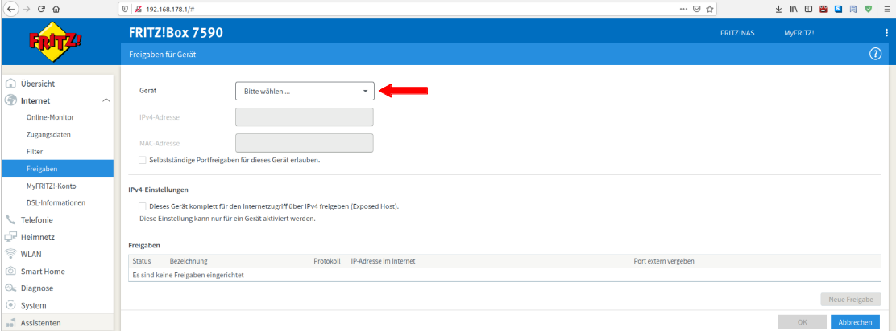
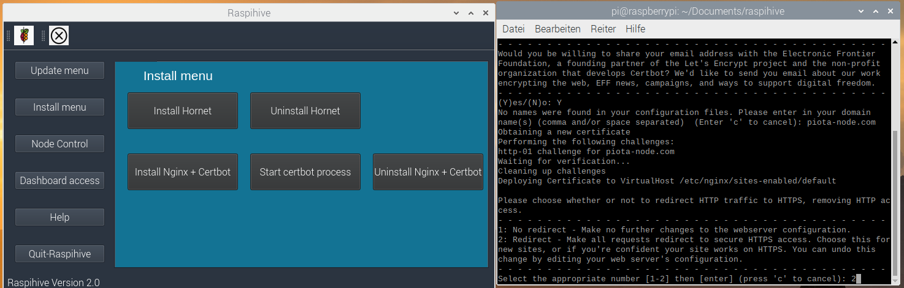

## 1 Hardware and software requirements
Hardware requirements:

- Rasperry Pi 4 with at least 4 GB RAM 
- a suitable case with fan for the Raspberry Pi
- Official Raspberry Pi power supply
- A 2.5 inch USB hard disk (from 250 GB or more) - - > Important: make sure that the USB-SSD hard disk is 
  supplied with an external power supply, i.e. a power adapter. I would recommend the following parts for this:
   [<b>We use this case from Amazon (klick)</b>](https://www.amazon.de/DIGITUS-71105-Festplattengeh%C3%A4use-SATA-schwarz/dp/B01N39MC0U/ref=sr_1_3?__mk_de_DE=%C3%85M%C3%85%C5%BD%C3%95%C3%91&dchild=1&keywords=DIGITUS%2B-%2BDA-71105%2B-%2BFestplattengeh%C3%A4use%2BSSD%2FHDD&qid=1607193916&sr=8-3&th=1)
   and: 
   [<b>This Power Supply from Amazon (klick)</b>](https://www.amazon.de/gp/product/B07R76FJS4/ref=ppx_yo_dt_b_asin_title_o00_s00?ie=UTF8&psc=1)
  and: 
   [<b>SSD Samsung Evo 500GB from Amazon (klick)</b>](https://www.amazon.de/Samsung-MZ-76E500B-EU-interne-schwarz/dp/B078WQT6S6/ref=sr_1_1?__mk_de_DE=%C3%85M%C3%85%C5%BD%C3%95%C3%91&dchild=1&keywords=Samsung+860+EVO+500GB+2%2C5&qid=1607193058&sr=8-1)
- USB - card reader for microSD cards
- Monitor with HDMI connector
- A Micro-HDMI to HDMI adapter
- One external USB keyboard + wired USB mouse
- Network or Ethernet LAN cable with an RJ 45 connector (CAT-6)
- Optional: Sunfounder 7 inch touchscreen display 
- Optional: 1 microSD card with 64 GB or more. (If you don't want to use a SSD, I would choose from
    However, we do not recommend continuous node operation for performance reasons. For test purposes this is completely sufficient) + USB - card reader for microSD cards


Software requirements:

You need the first two items, which I marked with M1, if you want to use the Raspihive image directly. 

    - M1: Download Raspihive Image
    - M1: BalenaEtcher - Flash Tool to flash the Raspihive Image to the USB-SSD-Harddisk

If you want to set up Raspihive on a general 64 bit Linux, you need the following software packages:

    - M2: A 64 bit Linux system like Debian or Ubuntu or Fedora etc. 
    - M2: Git (version management and version control tool)
    - M2: PIP3 (standard management tool for Python modules)
    - M2: Distro - an OS platform information API
    - M2: PyQt5 (PyQt5 is a comprehensive set of Python bindings for Qt v5 framework).


With that, we would have the tools of the trade together and we can now move on to the rest of the setup.


## 2. Option 1: Download the provided image and then flash the image with BalenaEtcher to a USB SSD hard disk or alternatively to a microSD card (use with a Raspberry Pi 4)

Download now the well-known flash tool BalenaEtcher:

- [ Download BalenaEtcher flash tool ](https://www.balena.io/etcher/)

Under Windows: Navigate to your download folder and double-click to start the installation of the program under Windows. 

Under Linux: navigate to your download folder and right-click on the downloaded BalenaEtcher Flash tool. Open the properties and click on the tab "Access rights" and check the box "Allow the file to run as a program". After that you can execute the file by double clicking on it. 

1. click on "Flash from file" and select the downloaded and unzipped "2020-05-27-raspios-buster-arm64.img", from your download folder on your computer 

<p>
    
</p>

Now select the target medium under "Select target", i.e. the connected USB-SSD hard disk. 


The connected USB SSD hard drive is usually automatically recognized by BalenaEtcher.


Note: If you receive the message "... your SSD drive is unusually large for an SD card or USB stick" you can ignore it. Click on Continue and then on Flash! 

Flash" starts the setup process, after the flash process is finished a validation process takes place and then you have created a bootable USB-SSD medium with the operating system Raspberry Pi OS (64 bit) - beta.




 Now you can plug the USB SSD hard drive into your USB 3 port of the Raspberry Pi or alternatively insert the microSD card into the Raspberry Pi and boot the Raspberry Pi.

After the boot process you can either click on "Run" or select "run in terminal". Usually it is sufficient to always click on the 1st option "Run". The 2nd option "Run in Terminal" is only needed for the optional initial setup of the reverse proxy + Certbot and for the Certbot verification process. 


After that you only need to set up the port shares in your router (point 4) and you can install Hornet directly with Raspihive (point 5). 
    - 4. setting up the port shares in the Fritz!Box (router)
    - 5. installation of Hornet fullnode

IMPORTANT: The default password for the user "pi" is: "raspihive". 

Of course you can easily change the set password. Click on the Raspberry icon in the upper left corner and select "Settings". 
Then click on "Raspberry Pi Configuration". 


Now click on "Change password..." and enter a new secure password. 

## 3. Possibility 2: cloning the Raspihive Github repository and basic setup of Raspihive for a 64 bit Linux system

If you do not want to use the provided image, then you can easily set up Raspihive on your 64-bit Linux system by simply following the setup steps below. 

For Raspihive to work on your system, the following software packages are required:
You can install the software packages for a Debian based distribution with:   

1. Git (version management and version control tool).  
Installation command:  ```sudo apt install git```

2. PIP for Python3 (standard management tool for Python modules) <br />
Installation command: ```sudo apt install python3-pip```

3. Distro - an OS platform information API <br />
Installation command: ```pip3 install distro```

4. PyQt5 (PyQt5 is a comprehensive set of Python bindings for Qt v5 framework). <br />
Installation command: ```sudo apt install python3-pyqt5```


After that we only have to change the Qt5 style from gtk2 to Fusion. To do this, enter the command: ```qt5ct``` in the terminal.


After that, click once on "apply" and close the window by clicking on "ok". 


Now you can easily clone the Raspihive repository into your home folder. 
To do this, open the terminal and enter the following two setup commands: 
cd .. (note the space between cd and ..)
sudo git clone https://github.com/Raspihive/raspihive.git


There are two ways to start Raspihive. You can navigate to the home folder every time you start Raspihive and enter the command to start it there: <br />
```python3 -m raspihive ``` <br />
or
you move the provided startup file "Raspihive" to your desktop and make it executable, so that you can start Raspihive in the future simply with two mouse clicks. 

You just have to enter the following three commands: 
<br />
```sudo mv Raspihive home/pi/Desktop ``` <br />
```cd home/pi/Desktop ```(please note that you have to enter your username instead of "pi") <br />
```sudo chmod +x Raspihive``` <br />




Now you can either click on "Run" or "Run in Terminal". Usually it is sufficient if you always click on the 1st option "Run". The 2nd option "Run in Terminal" is only needed for the optional initial setup of the reverse proxy + Certbot and for the Certbot verification process. 


After that you only need to set up the port shares in your router (point 4) and you can install Hornet directly with Raspihive (point 5). <br /> <br />
    - 4. setting up the port shares in the Fritz!Box (router)<br />
    - 5. installation of the Hornet fullnode
<br />

## 4. Setting up the port shares in the Fritz!Box (router)

Before we take care of setting up Raspihive, we currently need to share the following ports in our router.

Essential, Port: 14626, Protocol UDP - Autopeering

Essential, Port: 15600, Protocol TCP - Gossip (neighbors)

Optional, Port: 80 Protocol TCP - Certbot

Optional, Port: 443 Protocol TCP - Certbot

Since I am using a Fritz!Box, I will show you how to set up port sharing using the Fritzbox.

1. Open the user interface of the Fritz!Box by typing "fritz.box" or the local IP address: "192.168.178.1" into your browser.

The login password is usually printed on the bottom of the Fritz!Box. Take the "Fritz!Box password" and enter it on the login screen or on the login page of the Fritz!Box user interface and click on "Login"...



Then click on: "Internet" (1)...



--> "Shares" (2) - - > "Add device for shares" (3)...


Now select your Raspberry Pi under the item "Device". 



Then click on "New share" (2)...


Selects here under "Application" - - > "Other application" (1)...


Now enter the corresponding name (2), the corresponding protocol (UDP or TCP) (3) and the port number to be released (4). 


For the operation of a Hornet Node without an SSL certificate, it is sufficient if you release the first two "essential" ports. However, if you have your own domain, which you have entered under the item DnyDNS in the Fritz!Box, then you can also release the optional ports 80 - HTTP and 443 - HTTPS. After setting the port shares click on "OK", so that your set port shares are taken over...


and then click on "Apply" once again. The port shares are now set and activated. You can recognize this by the dots that change from gray to green. 


## 5. Installing the Hornet fullnode

To install Hornet you now only have to navigate to the "Install Menu" and click on "Install Hornet". 


It opens from left to right, the window for the progress display, in the middle an info window and on the far right the authentication window. After entering the correct password, the installation and setup of the Hornet node begins. 

The following packages are installed and configured: 

- System maintenance: apt-update and apt-autoremove
- Build-essential (package to compile a Debian package. It generally contains the GCC/g++ compiler and libraries and some other utilities).
- Git (software for distributed version control)
- Snapd (software distribution system and package management on Linux)


- Go (programming language)
- UFW (firewall - including the required port shares for Hornet)
- SSHGuard (to block brute force attacks)
- PPA for Hornet (package source for Hornet + automatic start of the node)


When the progress bar reaches 100%, you can simply click "ok". At this point, the node is already running and downloading the snapshot. 


If you take a look at the logs under "Node Control", you can see what the node is currently doing. Important: The Hornet dashboard is only accessible after the download of the snapshot and after the expiration of the spent address process. 


## 6. Optional: installation of the Nginx reverse proxy & Certbot and the steps to obtain an SSL certificate con Let's Encrypt 

If you want to connect the Hornet fullnode to Trinity, you need a reverse proxy with an SSL certificate. Furthermore, after the successful setup you will be able to reach your dashboard "worldwide" from the Internet. 

Precondition: If you have your own domain, e.g. from Selfhost, and have entered the DynDNS data in your Fritzbox or alternatively installed the No-IP-Client, you will be able to access your domain from the Internet under "Your-Domain.xx" after installing the Reverse Proxy + Certbot. 
To start the Nginx server as reverse proxy and the Certbot installation, you only have to click once on the button "Install Nginx + Certbot" and start the installation by entering your password correctly. 


During setup you will need to enter your password for dashboard access. For security reasons, this is entered twice... 


When the progress bar has reached 100%, you can simply click "ok" again to close the window. 


To start the certbot verification process, click once on "Start certbot proccess" and enter the command in the terminal window: 
<br />
```sudo certbot -nginx```
<br />
in the terminal window. After that you have to enter one after the other: 
<br />
    1. Enter your email address<br />
    2. Accept the Terms of Service with "A",<br />
    3. Decide with "Y" or "N" if the EFF is allowed to send you newsletters<br />
    4. Enter your domain<br />


    5. Just enter "2" here so that all requests are forwarded via HTTPS.



At the end you should see the message: "Congratulations" and a small summary about the installed SSL certificate. Now you can close the terminal window and access your node via your secured domain. 


Chrysalis customization to generate login data:
Open two new terminal windows and navigate to the Hornet folder in both:
cd / var / lib / hornet
Now give the command in the left terminal window:
sudo nano config.json
a. In the right terminal window give the command:
hornet tool pwdhash
and confirm with Enter. Now assign a password for your dashboard. Then two hash values are generated and displayed, which you have to copy into the config.json under Dashboard.


Now scroll down in the left window to the dashboard entry and insert a user name of your choice and the two hash values and save the changes with Ctrl + o and enter and exit the file with Ctrl + x. You can then log into the extended dashboard.


Important: It is best to update your Raspihive to version 2.1.2 and uninstall nginx once and reinstall it and start the Certbot process again.

## 7. Outlook and further development of Raspihive 

A lot has happened since the first official release of Raspihive 1.0. We have changed a lot under the hood this time and put our focus on security, functionality, usability and especially on a new design of Raspihive. For example, the user interface has been redesigned, where we now have a main selection menu on the left and the corresponding options in the right window. We hope you like the new view. 

 What are the next steps for Raspihive? We are always working on implementing new features that will make the installation and management of an IOTA fullnode as easy and pleasant as possible. In the near future, in addition to the Hornet installation, the installation and management of the new BEE node will also be integrated into Raspihive. Furthermore we are working on the integration of an adjustable "Auto-Update Feature" and many other ideas. 

If you are interested in developing with Python, we would be very happy to work with you to make these great ideas a reality and make them available to the IOTA community in the form of Raspihive.  


Thanks again to Olsche from www.easy-passphrase-saver.de as a tester for his valuable feedback, which made it possible to fix some annoying bugs in Raspihive ;). 

 
As always, if you have any questions, please feel free to contact us in the einfachIOTA Telegram group or in the einfachIOTA or Raspihive Discord Channel. 


Yours 
PIOTA


## 8. Update 08.03.2021 - Troubleshooting 

With some hard disk adapters it can happen that the USB 3.0 boot does not work immediately with the Raspberry Pi. In this case plug the USB SSD hard disk into the USB 2.0 port and add the storage.quirk entry in the boot/cmdline.txt as shown in the following screenshots: 

Open two terminal windows and enter in the right one the command: 

```lsusb``` 

You need the marked Device and Vendor ID. In the left terminal window you enter the two commands: 

```cd /``` 

and 

```sudo nano boot/cmdline.txt```


Now add in the cmdline.txt the entry: 

"usb-storage.quirks=152d:1337:u" and save the change with "Ctrl+o" and exit the file again with "Ctrl+x".


Now you can reboot the Raspberry once and then the USB 3.0 boot should work fine. 

